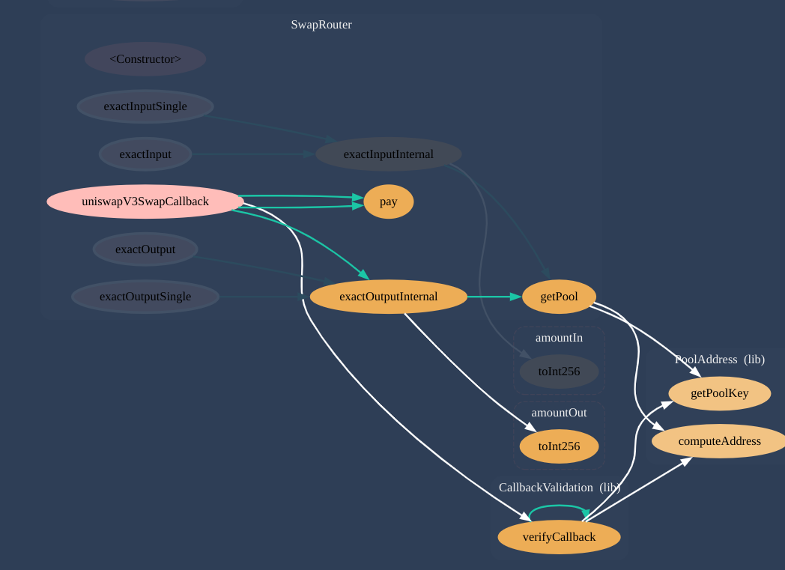
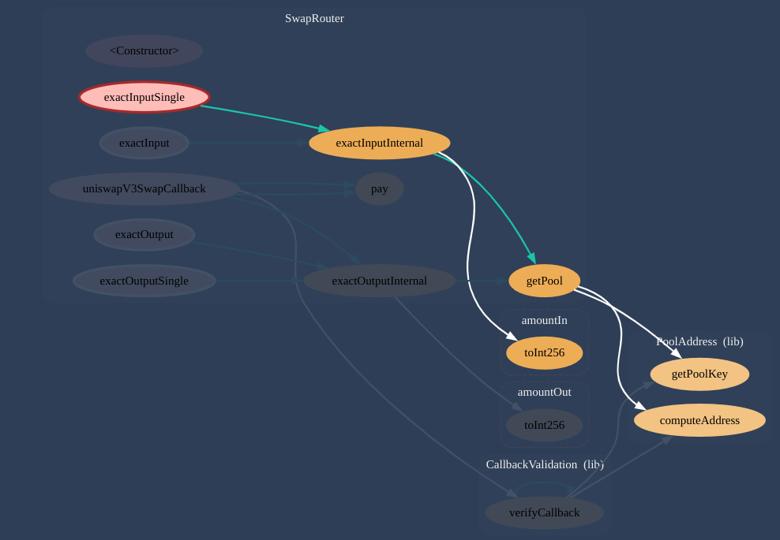
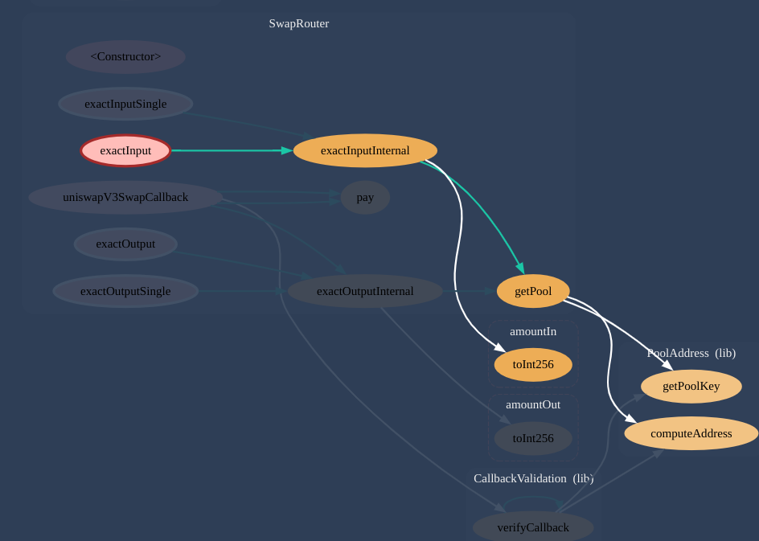
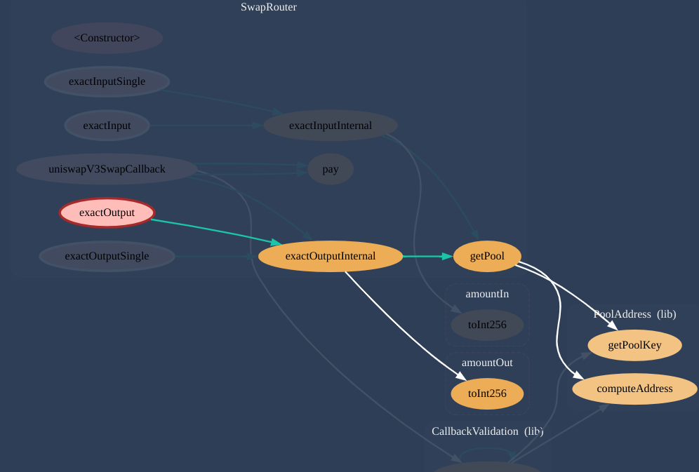

# uniswap-swapRouter-review
| Topic          | UniswapV3 SwapRouter.sol            |
| :------------- | :-----------------------------------|
| Title          | Smart Contract Review               |
| Author         | [Iam0TI](https://github.com/Iam0TI) |                                          |
| Date Created   |Novebemer 4, 2024                    |


](<Pasted image 20241104102610.png>)
> the graph diagram of [SwapRouter.sol](https://github.com/Uniswap/v3-periphery/blob/main/contracts/SwapRouter.sol)


## Overview

The `SwapRouter.sol` contract in Uniswap V3 is a central piece of the Uniswap ecosystem, it is used managing the token swap functionality.   It allows user to perform both single-token swaps and chained, multihop swaps across the uniswap V3 pools. This review delves into the core functionalities, libraries  and  system design within `SwapRouter.sol`. `SwapRouter.sol` uses Uniswap V3’s unique features, like [concentrated liquidity](https://docs.uniswap.org/concepts/protocol/concentrated-liquidity) and customizable fee . This review shows how this feature are used . 

The contract inherits from the following contracts, each giving the swapRouter a specific functionalities:

- **ISwapRouter**: Defines the core interface for swap operations, setting the functions required for both single- and multi-hop swaps.
- **PeripheryImmutableState**: Manages immutable state variables like the factory and WETH9 addresses.
- **PeripheryValidation**: Contains modifer `checkDeadline` to check if the deadline of a trade as passed.
- **PeripheryPaymentsWithFee** :  Contians functions to ease deposits and withdrawals of ETH  within the router.
- **Multicall** (Not used): Allows multiple function calls to be batched in a single transaction.
- **SelfPermit** (Not used): Implements EIP-2612 permits, allowing users to approve token allowances with signatures, reducing the need for separate approval transactions.


|File to Review | SLOC |
| :-------- | :------- |
| Contracts: 1 | |
| `SwapRouter.sol` | `214` |
| | |
| Import Path                                                    | Description                                                                                         |
|----------------------------------------------------------------|-----------------------------------------------------------------------------------------------------|
| `@uniswap/v3-core/contracts/libraries/SafeCast.sol`            | Provides safe casting functions for different data types, ensuring values fit within specified limits. |
| `@uniswap/v3-core/contracts/libraries/TickMath.sol`            | Contains mathematical functions for calculating tick prices, used for Uniswap V3 pool operations.   |
| `@uniswap/v3-core/contracts/interfaces/IUniswapV3Pool.sol`     | Interface for interacting with Uniswap V3 pools, facilitating swaps and liquidity management.       |
| `./interfaces/ISwapRouter.sol`                                 | Interface defining the functions of the Swap Router contract.                                       |
| `./base/PeripheryImmutableState.sol`                           | Contains immutable state variables like factory and WETH9 addresses.                                |
| `./base/PeripheryValidation.sol`                               | Handles time validation checks for swap router functions.                                                |
| `./base/PeripheryPaymentsWithFee.sol`                          | Manages payment transfers with additional fee-handling logic.                                       |
| `./libraries/Path.sol`                                         | Utility library for handling encoded swap paths.                                                    |
| `./libraries/PoolAddress.sol`                                  | Provides functions for computing pool addresses based on token pairs and fees.                      |
| `./libraries/CallbackValidation.sol`                           | Validates callback requests to ensure they originate from a valid Uniswap V3 pool.                  |
| `./base/Multicall.sol`                                         | Enables batch execution of multiple function calls within a single transaction.                     |
| `./base/SelfPermit.sol`                                        | Allows users to permit token transfers through EIP-2612 signatures, reducing the need for approvals.|
| `./interfaces/external/IWETH9.sol`                             | Interface for interacting with WETH9, wrapping and unwrapping ETH to/from WETH.                     |


Before delving in the main `SwapRouter` contract we need to understand some Libaries because they are important to the in working of the contract.

### Libraries Overview

#### 1. `Path.sol`

The **`Path`** library contains functions for manipulating path data for multihop swaps . Each path contains a list of token addresses and the fees associated with each token pool,. This encoding is used to set up  swaping routes in Uniswap v3, allowing users to swap multiple token pairs one after another through connected pools.

##### Constant Definitions

```solidity
uint256 private constant ADDR_SIZE = 20; // token address length in bytes
uint256 private constant FEE_SIZE = 3;   // pool fee length in bytes
uint256 private constant NEXT_OFFSET = ADDR_SIZE + FEE_SIZE;  // 23 bytes, total length for token + fee
uint256 private constant POP_OFFSET = NEXT_OFFSET + ADDR_SIZE; // 43 bytes, full pool segment length
uint256 private constant MULTIPLE_POOLS_MIN_LENGTH = POP_OFFSET + NEXT_OFFSET; // 66 bytes, min length for multi-pool path
```

Each constant represents:
- **`ADDR_SIZE`**: The byte length of the encoded token address (20 bytes).
- **`FEE_SIZE`**: The byte length of the encoded fee value for a pool (3 bytes). 
- **`NEXT_OFFSET`**: The byte length for a single token address and fee together (23 bytes). This means that each "pool" section (or "hop" in a multi-hop swap) occupies `20 + 3 = 23` bytes.

- **`POP_OFFSET`**: Total byte length(offset) for a pool , including two token addresses and a fee value (`TokenA` → `TokenB` → + `fee`)(43 bytes).
- **`MULTIPLE_POOLS_MIN_LENGTH`**: Minimum byte length of a path with two or more pools (66 bytes). Consider a multihop path from `TokenA` → `TokenB` → `TokenC` with fees of `0.3%` and `0.05%`  i.e  three token addresses (60 bytes), two fees (6 bytes).

##### Functions

##### 1. `hasMultiplePools`

```solidity
function hasMultiplePools(bytes memory path) internal pure returns (bool) {
    return path.length >= MULTIPLE_POOLS_MIN_LENGTH;
}
```

**Purpose**: To checks if the `path` has multiple pools (i.e., it involves multiple tokens and fees).
- **Parameters**: `path` - the bytes encoded swap path.
- **Returns**: `true` if the `path` length is equal to or more the `MULTIPLE_POOLS_MIN_LENGTH` (66 bytes), indicating two or more pools.

##### 2. `numPools`

```solidity
function numPools(bytes memory path) internal pure returns (uint256) {
    return ((path.length - ADDR_SIZE) / NEXT_OFFSET);
}
```

**Purpose**: to calculates the number of pools in the given path.
- **Parameters**: `path` - the bytes encoded swap path.
- **Returns**: The number of pools, calculated by taking the length of the path, subtracting the initial token address size, and dividing by the combined size of each token-fee pair (`NEXT_OFFSET`).
 - **Explanation** of `numPools` Calculation 

```solidity

Suppose we have a path with two pools:

Pool 1 :Token A → Fee → Token B
Pool 2 :Token B → Fee → Token C

In bytes, this would look like:

[Token A (20 bytes)] + [Fee (3 bytes)] + [Token B (20 bytes)] + [Fee (3 bytes)] + [Token C (20 bytes)] = 66 bytes 

Calculations in numPools

 We subtract 20 bytes from the total length to account for the initial token, leaving 66 - 20 = 46 bytes.
 
Dividing by NEXT_OFFSET (23) gives 46 / 23 = 2, indicating two pools in the path.

So, numPools will return 2 , representing two pools in the path.

```

##### 3. `decodeFirstPool`

```solidity
function decodeFirstPool(bytes memory path)
    internal
    pure
    returns (
        address tokenA,
        address tokenB,
        uint24 fee
    )
{
    tokenA = path.toAddress(0);                // tokenA address
    fee = path.toUint24(ADDR_SIZE);            // 3-byte fee following tokenA
    tokenB = path.toAddress(NEXT_OFFSET);      // tokenB address after fee
}
```

**Purpose**:To decode the first pool in the path, extracting the token addresses and fee.
- **Parameters**: `path` - the bytes encoded swap path.
- **Returns**: `tokenA` (first token address), `fee` (3-byte pool fee), `tokenB` (second token address).
- **Explanation**:
  - uses `path.toAddress(0)` to get the address of `tokenA`. 
  - extracts the fee using `path.toUint24(ADDR_SIZE)` at a 20-byte offset (after `tokenA`).
  -  uses `path.toAddress(NEXT_OFFSET)`  to get the `tokenB` address at `NEXT_OFFSET`, which is 23 bytes from the start (20 bytes for `tokenA` + 3 bytes for the fee).
> the `toAddress(bytes memory _bytes, uint256 _start)` function converts a  portion of the byte array into an  address, which is 20 bytes long. The `_start` parameter indicate the starting offset in the bytes for where to start reading the address. Similar, the `toUint24(bytes memory _bytes, uint256 _start)` function converts a 3-byte portion  of the byte array into a 24-bit unsigned integer. Similar to `toAddress`, the `_start` parameter indicate where in the byte array the conversion begins. This to function are from the BytesLib.sol

##### 4. `getFirstPool`

```solidity
function getFirstPool(bytes memory path) internal pure returns (bytes memory) {
    return path.slice(0, POP_OFFSET);
}
```

**Purpose**: To extracts the first pool portion in the path.
- **Parameters**: `path` - the bytes encoded swap path.
- **Returns**: A byte slice containing the first pool portion.
- **Explanation**: Uses `path.slice(0, POP_OFFSET)` to capture the portion from the start through `POP_OFFSET` (first two tokens and the fee).
> the `slice` function is also  from BytesLib.sol

##### 5. `skipToken`

```solidity
function skipToken(bytes memory path) internal pure returns (bytes memory) {
    return path.slice(NEXT_OFFSET, path.length - NEXT_OFFSET);
}
```

**Purpose**: To skips  token and fee portion, returning the remainder of the path.
- **Parameters**: `path` - the bytes encoded swap path.
- **Returns**: Remaining bytes after skipping the first token-fee portion.
- **Explanation**: `path.slice(NEXT_OFFSET, path.length - NEXT_OFFSET)` omits the first `NEXT_OFFSET` bytes (token + fee) from the path, returning what remains after this initial portion. 

###### Practical Example

Let’s look at a multihop path from `TokenA` → `TokenB` → `TokenC` with fees of `0.3%` and `0.05%`:
1. Path Encoding: `TokenA` (20 bytes) + `0.3%` (3 bytes) + `TokenB` (20 bytes) + `0.05%` (3 bytes) + `TokenC` (20 bytes) = 66 bytes.
2. **`hasMultiplePools`**: This function would return `true` since the path length (66 bytes) is at least `MULTIPLE_POOLS_MIN_LENGTH`.
3. **`numPools`**: This function would return 2, indicating two pools in the path.
4. **`decodeFirstPool`**: Returns `TokenA`, `TokenB`, and `0.3%`.
5. **`getFirstPool`**: Returns the first 43 bytes, enough to contain `TokenA`, `TokenB`, and `0.3%`.
6. **`skipToken`**: Skips `TokenA` and `0.3%`, returning the remaining path for `TokenB` → `TokenC` with `0.05%` fee.


#### 2. `PoolAddress.sol`


The **`PoolAddress`** library provides functions to get the address of a Uniswap V3 pool based on its factory,the pair tokens, and the fee.

##### Constants
 **`POOL_INIT_CODE_HASH`**: A constant that represents the initi code hash for Uniswap V3 pools. This value is used in computing the pool address. we will see why the is needed in a bit.

##### Struct
The `PoolKey` struct represents the  structure a pool and includes the addresses of the first and second tokens in the pool (sorted as `token0` and `token1`, respectively) along with the  pool fee.

##### Functions

##### 1.`getPoolKey`

```solidity
function getPoolKey(
address tokenA,
address tokenB,
uint24 fee
) internal pure returns (PoolKey memory) {
if (tokenA > tokenB) (tokenA, tokenB) = (tokenB, tokenA);
return PoolKey({token0: tokenA, token1: tokenB, fee: fee});
}
```

- **Purpose** : To  ordered tokens addresses and returns a `PoolKey` that includes the ordered tokens and the pool fee.
- **Parameters**:
    - `tokenA`: The first token of a pool.
    - `tokenB`: The second token of a pool. 
    - `fee`: The fee level of the pool.
- **Returns**: A `PoolKey` struct that contains the ordered `token0` and `token1` assignments, ensuring `token0` is always less than `token1`.

**Explanation**: The function checks if `tokenA` is greater than `tokenB` and swaps them if necessary to maintain the order. It then creates and returns a `PoolKey` with the ordered tokens and the fee.

##### 2. `computeAddress`

``` solidity
function computeAddress(address factory, PoolKey memory key) internal pure returns (address pool) {
require(key.token0 < key.token1);
pool = address(uint256(keccak256(abi.encodePacked(hex'ff',factory,keccak256(abi.encode(key.token0, key.token1, key.fee)),POOL_INIT_CODE_HASH))));}
```


- **Purpose**: To computes the address of a pool deterministically given the factory address and the PoolKey.
- **Parameters**:
    - `factory`: The address of the Uniswap V3 factory contract.
    - `key`: The PoolKey containing the tokens and fee.
- **Returns**: The contract address of the V3 pool.

**Explanation**: The function requires that token0 is less than token1. It then computes the pool's address using the provided factory address, the hash of the tokens and fee, and the POOL_INIT_CODE_HASH. [Just like how new contract are deployer using Create2](https://eips.ethereum.org/EIPS/eip-1014). The result is a deterministic pool address of the pairs.


#### 3. `CallbackValidation.sol`

The **`CallbackValidation`** library contains functions to validate callbacks from Uniswap V3 Pools. It ensures that the callbacks made to the pool are from valid and authorized addresses, helping to prevent unauthorized interactions with the pool contracts.

##### Function
##### 1. `verifyCallback` 

```solidity
function verifyCallback(address factory, PoolAddress.PoolKey memory poolKey)
internal view returns (IUniswapV3Pool pool)
{
pool = IUniswapV3Pool(PoolAddress.computeAddress(factory, poolKey));
    require(msg.sender == address(pool));
}
```

- **Purpose**: To verify if the sender of the callback is the expected  Uniswap  V3 pool.
- **Parameters**:
        `factory`: The contract address of the Uniswap V3 factory.
        `poolKey`: The identifying key of the V3 pool that includes the token addresses and the fee.
- **Returns**:  `pool` : A uniswap v3 pool contract address.
- **Explanation**:The function calls `PoolAddress.computeAddress(..)`  to compute the pool after that it checks that the sender of the callback (msg.sender) is indeed the computed pool address. If the sender is not the expected pool address, the transaction will revert.
##### 2. `verifyCallback`

```solidity
function verifyCallback(
    address factory,
    address tokenA,
    address tokenB,
    uint24 fee
) internal view returns (IUniswapV3Pool pool) {
    return verifyCallback(factory, PoolAddress.getPoolKey(tokenA, tokenB, fee));
}
```

**Purpose**: To verify if the sender of the callback is the expected  Uniswap  V3 pool.

- **Parameters**:
    - `factory`: The contract address of the Uniswap V3 factory.
    - `tokenA`: The contract address of either token0 or token1 in the pool.
    - `tokenB`: The contract address of the other token in the pool.
    - `fee`: The pool
- **Returns**:  `pool` : A uniswap v3 pool contract address.
- **Explanation** : The function makes a call to `PoolAddress.getPoolKey()` which return a `Poolkey` and `factorty` are passed as parameter to the first `verifyCallback` function and that Verification and computation of the pool address happens. 


### Contract Review 

Now Let's delving into the inner workings of the coNtract .


#### State Variable and Library Usage

```solidity 
    using Path for bytes;
    using SafeCast for uint256;

    /// @dev Used as the placeholder value for amountInCached, because the computed amount in for an exact output swap
    /// can never actually be this value
    uint256 private constant DEFAULT_AMOUNT_IN_CACHED = type(uint256).max;

    /// @dev Transient storage variable used for returning the computed amount in for an exact output swap.
    uint256 private amountInCached = DEFAULT_AMOUNT_IN_CACHED;


```

1. **Library Usage**
   - `using Path for bytes;`: This line allows the contract to extend the functionality of the `bytes` type with the `Path` library in `Path.sol`. It is used for handling paths during token swaps by decoding the route of token transfers.

   - `using SafeCast for uint256;`: This line enables the use of the `SafeCast` library on the `uint256` type. Since we are using `solidity version 0.7.6;` , `SafeCast` provides safe way for casting between different integer types, which helps prevent overflow and underflow errors .

2. **State Variables**
   - `uint256 private constant DEFAULT_AMOUNT_IN_CACHED = type(uint256).max;`: This constant defines a placeholder value for `amountInCached`. It is set to the maximum value of `uint256`, indicating that this value is used when the actual amount in for an exact output swap is not yet computed.
   - `uint256 private amountInCached = DEFAULT_AMOUNT_IN_CACHED;`: This transient storage variable holds the computed amount in for an exact output swap. It is initialized with the `DEFAULT_AMOUNT_IN_CACHED` value, signaling that the actual amount has yet to be determined.

These components work together to ensure efficient management of swap calculations and maintain safety in type conversions within the `SwapRouter` contract.

#### Fucntions 

##### 1. Constructor

```solidity 
constructor(address _factory, address _WETH9) PeripheryImmutableState(_factory, _WETH9) {}

```

**Purpose**: To sets up the contract initial state variable in `PeripheryImmutableState`.


- **Parameters**:
  - `address _factory`: The address of the Uniswap V3 factory contract, which is responsible for creating new liquidity pools.
  - `address _WETH9`: The address of the Wrapped Ether (WETH) contract.It the router to handle ETH by wrapping it as WETH for token swaps.

- **Inheritance**: 
  - `PeripheryImmutableState(_factory, _WETH9)`: The constructor of the `PeripheryImmutableState` base contract is called with `_factory` and `_WETH9` as arguments. 

- **Explanation**:  


###### 2. `getPool`

```solidity
function getPool(address tokenA, address tokenB, uint24 fee) private view returns (IUniswapV3Pool) {
    return IUniswapV3Pool(PoolAddress.computeAddress(factory, PoolAddress.getPoolKey(tokenA, tokenB, fee)));
}
```

**Purpose**:  
The `getPool` function gets the Uniswap V3 pool contract address for a specified token pair . It used the `PoolAddress` library to compute the pool address based on the factory contract, token addresses, and fee. 

**Parameters**:  
- `tokenA`: The address of the first token in the pool.
- `tokenB`: The address of the second token in the pool.
- `fee`: The fee tier of the pool, represented as a 24-bit unsigned integer.

**Returns**:  
- `IUniswapV3Pool`: A Uniswap V3 pool contract address for the specified token pair and fee.

**Explanation**:
1. **Pool Key Ordering**:  
   Using `PoolAddress.getPoolKey(tokenA, tokenB, fee)` to generate a unique, ordered key for the token pair and fee. This ensures the token order is consistent for pool address computation.

2. **Compute Pool Address**:  
   Using `PoolAddress.computeAddress(factory, poolKey)` to get the pool’s address based on the `CREATE2` formula used during pool deployment. 

3. **Type Casting**:  
   Casts the computed address to `IUniswapV3Pool` to enable interaction with the Uniswap V3 pool's functions.

**Libraries Used**:
- `PoolAddress`:  
    - `getPoolKey`: Generates a unique, ordered identifier for the token pair and fee to maintain consistency.
    - `computeAddress`: Computes a pool's address based on the factory address and pool key.
  

##### 3. `uniswapV3SwapCallback`


> the excution graph of uniswapV3SwapCallback

```solidity

struct SwapCallbackData {
        bytes path;
        address payer;
    }

    /// @inheritdoc IUniswapV3SwapCallback
    function uniswapV3SwapCallback(
        int256 amount0Delta,
        int256 amount1Delta,
        bytes calldata _data
    ) external override {
        require(amount0Delta > 0 || amount1Delta > 0); // swaps entirely within 0-liquidity regions are not supported
        SwapCallbackData memory data = abi.decode(_data, (SwapCallbackData));
        (address tokenIn, address tokenOut, uint24 fee) = data.path.decodeFirstPool();
        CallbackValidation.verifyCallback(factory, tokenIn, tokenOut, fee);

        (bool isExactInput, uint256 amountToPay) =
            amount0Delta > 0
                ? (tokenIn < tokenOut, uint256(amount0Delta))
                : (tokenOut < tokenIn, uint256(amount1Delta));
        if (isExactInput) {
            pay(tokenIn, data.payer, msg.sender, amountToPay);
        } else {
            // either initiate the next swap or pay
            if (data.path.hasMultiplePools()) {
                data.path = data.path.skipToken();
                exactOutputInternal(amountToPay, msg.sender, 0, data);
            } else {
                amountInCached = amountToPay;
                tokenIn = tokenOut; // swap in/out because exact output swaps are reversed
                pay(tokenIn, data.payer, msg.sender, amountToPay);
            }
        }
    }
```

**Purpose**:  
The `uniswapV3SwapCallback` function handles the callback required during a Uniswap v3 swap. It check the swap if valid and handles payments depending on whether it is an exact input or exact output swap. For exact output swaps, either initiate the next swap  or pay if it's the last pool.

**Parameters**:
- `amount0Delta`: `int256` - The change in amount of token0 as a result of the swap.
- `amount1Delta`: `int256` - The change in amount of token1 as a result of the swap.
- `_data`: `bytes calldata` - Encoded data for the swap callback, containing the path and payer address.

**Returns**:  
None. This is a callback functions.

**Explanation**:  
- The function first checks that either `amount0Delta` or `amount1Delta` is positive, ensuring there’s liquidity in the swap region (remember concentrated liquidity ).
- It decodes `_data` into a `SwapCallbackData` struct, extracting the path, token addresses, and fee.
- Using `CallbackValidation.verifyCallback`, it verifies that the callback is valid by checking the factory, `tokenIn`, `tokenOut`, and fee i.e the call is from a uniswap v3 pool.
- Depending on the delta values, it determines whether the swap is an exact input or exact output and sets `amountToPay` to the respective delta amount.
    **For :**
  - **Exact Input Swap**: If it's an exact input swap (`isExactInput` is true), the function calls `pay` (inherited from   `PeripheryPayments`) to transfer `amountToPay` from `data.payer` to `msg.sender` for `tokenIn`.
  
  - **Exact Output Swap**: If it's an exact output swap, the function checks if the `path` has more pools:
    - If **more pools** exist, it skips the current token and initiates the next swap using `exactOutputInternal`.
    - If **no more pools** are in the path, it caches `amountToPay` in `amountInCached` and swaps the token directions (in/out). Finally, it calls `pay` to complete the payment.

**Libraries Used**:  
- `CallbackValidation`: Used to validate the swap callback.
- `Path`: Provides methods like `decodeFirstPool` and `skipToken` to handle path decoding and token skipping for multi-pool swaps.


##### 4. `exactInputInternal`


```solidity
function exactInputInternal(
    uint256 amountIn,
    address recipient,
    uint160 sqrtPriceLimitX96,
    SwapCallbackData memory data
) private returns (uint256 amountOut) {
    // allow swapping to the router address with address 0
    if (recipient == address(0)) recipient = address(this);

    (address tokenIn, address tokenOut, uint24 fee) = data.path.decodeFirstPool();

    bool zeroForOne = tokenIn < tokenOut;

    (int256 amount0, int256 amount1) =
        getPool(tokenIn, tokenOut, fee).swap(
            recipient,
            zeroForOne,
            amountIn.toInt256(),
            sqrtPriceLimitX96 == 0
                ? (zeroForOne ? TickMath.MIN_SQRT_RATIO + 1 : TickMath.MAX_SQRT_RATIO - 1)
                : sqrtPriceLimitX96,
            abi.encode(data)
        );

    return uint256(-(zeroForOne ? amount1 : amount0));
}

```

**Purpose**:  
This function performs a single exact input swap in the Uniswap V3 protocol, allowing users to exchange a specified amount of one token for another.

**Parameters**:  
- `uint256 amountIn`: The amount of the input token to be swapped.  
- `address recipient`: The address that will receive the output tokens. If this is set to the zero address, it is replaced with the router's address.  
- `uint160 sqrtPriceLimitX96`: The square root price limit for the swap, specified in fixed-point Q96 format. If this is zero, it uses a calculated boundary value based on the swap direction.  
- `SwapCallbackData memory data`: A structure that contains additional information for the swap, including the token path and fee.  

**Returns**:  
- `uint256 amountOut`: The amount of the output token received from the swap.


**Explanation**:  
The function first checks if the `recipient` is the zero address. If so, it sets the recipient to the contract's address, allowing swaps to be conducted directly to the router. It then decodes the path from the `data` structure to obtain the `tokenIn`, `tokenOut`, and fee for the swap. 

Next, it determines the direction of the swap (`zeroForOne`) by checking if the address `tokenIn` is less than `tokenOut`.Then the `getPool` function is called to retrieve the right liquidity pool for the swap, and the `swap` method is called on the returned pool to be perform the swap . The  swap parameters include:

- `recipient`: The address receiving the output tokens.
- `zeroForOne`: A boolean indicating the swap direction.
- `amountIn`: The input amount converted to an integer.
- `sqrtPriceLimitX96`: The function checks if whether price limit  was provided if not it uses the tick boundary value from the `TickMath` libary depending on the swap direction. If the swap is from `tokenIn` to `tokenOut` `zeroForOne` is true so `sqrtPriceLimitX96` is  `TickMath.MIN_SQRT_RATIO + 1`  else `sqrtPriceLimitX96` is ` TickMath.MAX_SQRT_RATIO -1 `
- `data`: The encoded callback data.

Finally, it calculates and returns the output amount by converting the negative value of the amount withdrawn from the pool, based on the swap direction.


**Libraries Used**:  
- `Path`: To decodes the path to obtain each pools and to determine if multiple pools exist.  
- `SafeCast`: For safely casting between integer types.
- `TickMath`: To determine the value of `sqrtPriceLimitX96`

##### 5. `exactInputSingle`



> the excution graph of exactInputSingle

```solidity 
struct ExactInputSingleParams {
        address tokenIn;
        address tokenOut;
        uint24 fee;
        address recipient;
        uint256 deadline;
        uint256 amountIn;
        uint256 amountOutMinimum;
        uint160 sqrtPriceLimitX96;
    }

function exactInputSingle(ExactInputSingleParams calldata params)
        external
        payable
        override
        checkDeadline(params.deadline)
        returns (uint256 amountOut)
    {
        amountOut = exactInputInternal(
            params.amountIn,
            params.recipient,
            params.sqrtPriceLimitX96,
            SwapCallbackData({path: abi.encodePacked(params.tokenIn, params.fee, params.tokenOut), payer: msg.sender})
        );
        require(amountOut >= params.amountOutMinimum, "Too little received");
    }


```


**Purpose**:  
The `exactInputSingle` function performs a single-hop exact input swap. The function takes specific parameters for a single  token swap ,  and send the input amount to the specified recipient, and  also verifies that the output meets a minimum  amountOut.

**Parameters**:
- `params`: `ExactInputSingleParams calldata` - A struct containing parameters required for the swap, including:
  - `amountIn`: The input token amount.
  - `recipient`: The address receiving the output tokens.
  - `sqrtPriceLimitX96`: The square root price limit for the swap.
  - `tokenIn`: The input token's address.
  - `fee`: The swap fee tier.
  - `tokenOut`: The output token's address.
  - `amountOutMinimum`: The minimum acceptable amount of output tokens.
  - `deadline`: The swap's expiration time.

**Returns**:  
- `amountOut`: `uint256` - The actual amount of output tokens received from the swap.

**Explanation**: 
 **Deadline Check**  
   The function check the swap deadline by using the `checkDeadline` modifier (inheritied from`PeripheryValidation`) . If the transaction does not meet this deadline, it reverts.

- The `exactInputSingle` function begins by calling `exactInputInternal` with the input amount and other parameters extracted from `params`.
- It uses `abi.encodePacked` to create a packed path (containing `tokenIn`, `fee`, and `tokenOut`) for the swap and encodes it in the `SwapCallbackData` struct, setting `payer` to the `msg.sender`.
- The `exactInputInternal` function returns the actual output amount, which is stored in `amountOut`.
- A `require` statement then checks if `amountOut` meets or exceeds `params.amountOutMinimum`. If not, it reverts with an error, "Too little received."

**Libraries Used**:  
- None , (Kindof), it  `exactInputInternal` uses the `Path` and `CallbackValidation` libraries indirectly.


##### 6. `exactInput`



> the excution graph of exactInput
``` solidity

struct ExactInputParams {
        bytes path;
        address recipient;
        uint256 deadline;
        uint256 amountIn;
        uint256 amountOutMinimum;
    }

  
function exactInput(ExactInputParams memory params)
        external
        payable
        override
        checkDeadline(params.deadline)
        returns (uint256 amountOut)
    {
        address payer = msg.sender; // msg.sender pays for the first hop

        while (true) {
            bool hasMultiplePools = params.path.hasMultiplePools();

            // the outputs of prior swaps become the inputs to subsequent ones
            params.amountIn = exactInputInternal(
                params.amountIn,
                hasMultiplePools ? address(this) : params.recipient, // for intermediate swaps, this contract custodies
                0,
                SwapCallbackData({
                    path: params.path.getFirstPool(), // only the first pool in the path is necessary
                    payer: payer
                })
            );

            // decide whether to continue or terminate
            if (hasMultiplePools) {
                payer = address(this); // at this point, the caller has paid
                params.path = params.path.skipToken();
            } else {
                amountOut = params.amountIn;
                break;
            }
        }

        require(amountOut >= params.amountOutMinimum, "Too little received");
        }

 ```


**Purpose**:  
The `exactInput` function performs a multi-hop swap, meaning it allows a user to swap `amountIn` of one token for as much as possible of another token by following a specified path that can include multiple pools. The function  calls `exactInputInternal` to handle each hop in the swap path, with each intermediate swap's output becoming the input for the next. 

**Parameters**:  
- `params` (`ExactInputParams`): Contains all necessary inputs for the swap:
  - `path`: The token swap path, encoded in a sequence of tokens and fees, specifying the pools to use.
  - `recipient`: The final recipient address of the output tokens.
  - `deadline`: A timestamp after which the transaction will revert if not completed.
  - `amountIn`: The exact amount of the input token to be swapped.
  - `amountOutMinimum`: The minimum acceptable amount of the output token.

**Returns**:  
- `amountOut` (`uint256`): The total amount of the output token received by the recipient at the end of the swap.

**Explanation**:  
 **Deadline Check**  
   The function check the swap deadline by using the `checkDeadline` modifier (inheritied from`PeripheryValidation`) . If the transaction does not meet this deadline, it reverts.

1. **Setting the Initial Payer**  
   The function starts by setting the `payer` as `msg.sender`, which will be responsible for covering the input cost for the first swap.

2. **Loop Swapping**  
   A `while` loop is used to process each hop in the path. For each iteration:
   - It checks if there are multiple pools in the path using `hasMultiplePools`.
   - It calls `exactInputInternal` to perform the swap for the current hop, passing in the following:
     - `params.amountIn` as the amount to swap.
     - The recipient for this hop: either `params.recipient` if this is the final hop, or `address(this)` if intermediate (to hold tokens temporarily).
     - The `path` for this hop, decoded to obtain the required pool (using `params.path.getFirstPool()`).
     - `payer` as the payer for this particular swap.

3. **Path Management**  
   After each swap:
   - If there are multiple pools remaining, `payer` is set to `address(this)` to show that any further swaps are paid by the contract itself, and `params.path` is updated by removing the first token using `skipToken()`.
   - If no additional pools remain, `amountOut` is set to the final `params.amountIn` from the last swap, marking the end of the multi-hop swap.

4. **Output Validation**  
   Finally, `amountOut` is compared to `params.amountOutMinimum` using `require`. If `amountOut` is less than expected, the transaction reverts with an error ("Too little received"), ensuring that the recipient receives a minimum acceptable amount after all swaps.

**Libraries Used**:  
- `Path`: To decodes the path to obtain each pools and to determine if multiple pools exist.
  


##### 6. `exactOutputInternal`

```solidity

    // In the swap function, we add two new parameters: zeroForOne and amountSpecified. zeroForOne is the flag that controls swap direction:
    // when true, token0 is traded in for token1; when false, it’s the opposite. For example, if token0 is ETH and token1 is USDC
    // , setting zeroForOne to true means buying USDC for ETH. amountSpecified is the number of tokens the user wants to sell.

    /// @dev Performs a single exact output swap
    function exactOutputInternal(
        uint256 amountOut,
        address recipient,
        uint160 sqrtPriceLimitX96,
        SwapCallbackData memory data
    ) private returns (uint256 amountIn) {
        // allow swapping to the router address with address 0
        if (recipient == address(0)) recipient = address(this);

        (address tokenOut, address tokenIn, uint24 fee) = data.path.decodeFirstPool();

        bool zeroForOne = tokenIn < tokenOut;

        (int256 amount0Delta, int256 amount1Delta) = getPool(tokenIn, tokenOut, fee).swap(
            recipient,
            zeroForOne,
            -amountOut.toInt256(),
            sqrtPriceLimitX96 == 0
                ? (zeroForOne ? TickMath.MIN_SQRT_RATIO + 1 : TickMath.MAX_SQRT_RATIO - 1)
                : sqrtPriceLimitX96,
            abi.encode(data)
        );

        uint256 amountOutReceived;
        (amountIn, amountOutReceived) = zeroForOne
            ? (uint256(amount0Delta), uint256(-amount1Delta))
            : (uint256(amount1Delta), uint256(-amount0Delta));
        // it's technically possible to not receive the full output amount,
        // so if no price limit has been specified, require this possibility away
        if (sqrtPriceLimitX96 == 0) require(amountOutReceived == amountOut);
    }


```

**Purpose**:  
The `exactOutputInternal` function performs a single exact output swap. This function is designed to swap as few input tokens as possible to receive an exact amount of the output token (`amountOut`). It enables users to specify the exact amount of tokens they wish to receive.

**Parameters**:  
- `amountOut` (`uint256`): The exact amount of the output token that the user wants to receive.
- `recipient` (`address`): The address that will receive the output tokens. If `recipient` is the zero address, it defaults to the contract address (`address(this)`).
- `sqrtPriceLimitX96` (`uint160`): The square root price limit for the swap, specified in fixed-point Q96 format. If this is zero, it uses a calculated boundary value based on the swap direction.  
- `data` (`SwapCallbackData`): Contains encoded callback data:
  - `path`: Specifies the pool path for the swap.
  - `payer`: The address responsible for paying for the swap.

**Returns**:  
- `amountIn` (`uint256`): The amount of the input token actually spent to achieve the exact output.

**Explanation**:  
1. **Recipient Address Check**  
   The function first checks if `recipient` is the zero address (address `0x0`). If so, it sets `recipient` to the contract’s address (`address(this)`) to allow direct swaps to the router.

2. **Path Decoding and Swap Direction**  
   It decodes the first pool in the path to obtain `tokenIn`, `tokenOut`, and `fee`. The swap direction (`zeroForOne`) is determined by comparing the addresses of `tokenIn` and `tokenOut`: if `tokenIn` is less than `tokenOut`, `zeroForOne` is set to `true` (meaning the trade  is from `tokenIn` to `tokenOut`).

3. **Executing the Swap**  
   The function calls the `swap` method on the pool:
   - `recipient`: Address that will receive the output tokens.
   - `zeroForOne`: Determines swap direction, where `true` represents `token0` to `token1` and `false` is the reverse.
   - `-amountOut.toInt256()`: Specifies the amount the user wants to receive as a negative integer, as Uniswap V3 interprets negative values for output targets.
   - `sqrtPriceLimitX96`:  The function checks if whether price limit  was provided if not it uses the tick boundary value from the `TickMath` libary depending on the swap direction. If the swap is from `tokenIn` to `tokenOut` `zeroForOne` is true so `sqrtPriceLimitX96` is  `TickMath.MIN_SQRT_RATIO + 1`  else `sqrtPriceLimitX96` is ` TickMath.MAX_SQRT_RATIO -1 `
   - `abi.encode(data)`: Passes the callback data for the swap operation.

4. **Amount Calculation**  
   After the swap, `amount0Delta` and `amount1Delta` are returned, which represents changes in the token balances. The function calculates:
   - `amountIn`: The amount of `tokenIn` required to perform the swap.
   - `amountOutReceived`: The actual amount of `tokenOut` received. 

5. **Output Validation**  
   If `sqrtPriceLimitX96` is zero (no price limit was specified), the function requires that `amountOutReceived` matches `amountOut` exactly.

**Libraries Used**:  
- `Path`: To decodes the path to obtain each pools and to determine if multiple pools exist.  
- `SafeCast`: For safely casting between integer types.


##### 7. `exactOutputSingle`


> the excution graph of exactOutputSingle

```solidity 

struct ExactOutputSingleParams {
        address tokenIn;
        address tokenOut;
        uint24 fee;
        address recipient;
        uint256 deadline;
        uint256 amountOut;
        uint256 amountInMaximum;
        uint160 sqrtPriceLimitX96;
    }

    /// @inheritdoc ISwapRouter
    function exactOutputSingle(ExactOutputSingleParams calldata params)
        external
        payable
        override
        checkDeadline(params.deadline)
        returns (uint256 amountIn)
    {
        // avoid an SLOAD by using the swap return data
        amountIn = exactOutputInternal(
            params.amountOut,
            params.recipient,
            params.sqrtPriceLimitX96,
            SwapCallbackData({path: abi.encodePacked(params.tokenOut, params.fee, params.tokenIn), payer: msg.sender})
        );

        require(amountIn <= params.amountInMaximum, "Too much requested");
        // has to be reset even though we don't use it in the single hop case
        amountInCached = DEFAULT_AMOUNT_IN_CACHED;
    }


```

**Purpose**:  
The `exactOutputSingle` function performs a single-hop exact output swap, where the goal is to receive a specific amount (`amountOut`) of `tokenOut` by spending as little of `tokenIn` as possible, but not exceeding a maximum input amount (`amountInMaximum`). 

**Parameters**:  
- `params` (`ExactOutputSingleParams`): A struct that holds the parameters required for the exact output swap:
  - `tokenIn` (`address`): The input token address.
  - `tokenOut` (`address`): The output token address.
  - `fee` (`uint24`): The pool fee for the swap.
  - `recipient` (`address`): Address that will receive the output tokens.
  - `deadline` (`uint256`): A timestamp after which the transaction will revert if not completed.
  - `amountOut` (`uint256`): Exact amount of output tokens desired.
  - `amountInMaximum` (`uint256`): Maximum amount of input tokens allowed to be spent.
  - `sqrtPriceLimitX96` (`uint160`): Optional square root price limit for controlling the price range during the swap.

**Returns**:  
- `amountIn` (`uint256`): The actual amount of the input token used in the swap.

**Explanation**:  
1. **Deadline Check**  
   The function check the swap deadline by using the `checkDeadline` modifier (inheritied from`PeripheryValidation`) . If the transaction does not meet this deadline, it reverts.

2. **Executing the Swap**  
   - The `exactOutputInternal` function is called to perform the swap. This function:
     - Takes the `amountOut`, `recipient`, and `sqrtPriceLimitX96` from `params`.
     - Encodes the swap path using `params.tokenOut`, `params.fee`, and `params.tokenIn`, since `exactOutputInternal` requires `tokenOut` to come first.
     - Sets the `payer` as `msg.sender`.
   - The function returns the `amountIn`, representing the actual amount of input tokens required to get the desired output.

3. **Input Validation**  
   The function then verifies that the `amountIn` did not exceed `params.amountInMaximum`. If it did, the transaction reverts with `"Too much requested"`.

4. **Resetting Transient Storage**  
   The transient storage variable `amountInCached` is reset to `DEFAULT_AMOUNT_IN_CACHED` (a placeholder constant),   even though we don't use it in the single hop case. This reset maintains consistency for future multi-hop swaps that  rely on `amountInCached`.

**Libraries Used**:  
- `Path`: To decodes the path to obtain each pools and to determine if multiple pools exist.
- `SafeCast`: For safely casting between integer types.


##### 8. `exactOutput`


> the excution graph of exactOutput

```solidity 

struct ExactOutputParams {
        bytes path;
        address recipient;
        uint256 deadline;
        uint256 amountOut;
        uint256 amountInMaximum;
    }

    /// @inheritdoc ISwapRouter
    function exactOutput(ExactOutputParams calldata params)
        external
        payable
        override
        checkDeadline(params.deadline)
        returns (uint256 amountIn)
    {
        // it's okay that the payer is fixed to msg.sender here, as they're only paying for the "final" exact output
        // swap, which happens first, and subsequent swaps are paid for within nested callback frames
        exactOutputInternal(
            params.amountOut, params.recipient, 0, SwapCallbackData({path: params.path, payer: msg.sender})
        );

        amountIn = amountInCached;
        require(amountIn <= params.amountInMaximum, "Too much requested");
        amountInCached = DEFAULT_AMOUNT_IN_CACHED;
    }

```
### `exactOutput` Function

**Purpose**:  
The `exactOutput` function performs a multi-hop exact output swap, trying to get a specific amount (`amountOut`) of the output token by spending as little of the input token as possible, with a maximum input limit (`amountInMaximum`). 

**Parameters**:  
- `params` (`ExactOutputParams`): A struct containing the parameters for the exact output multi-hop swap:
  - `path` (`bytes`): Encoded path detailing the token sequence for multi-hop swaps.
  - `recipient` (`address`): The address that will receive the final output tokens.
  - `deadline` (`uint256`): A timestamp after which the transaction will revert if not completed.
  - `amountOut` (`uint256`): The exact amount of output tokens desired.
  - `amountInMaximum` (`uint256`): The maximum allowed input amount, preventing overspending.

**Returns**:  
- `amountIn` (`uint256`): The actual amount of input tokens used to complete the swap.

**Explanation**:  
1. **Deadline Check**  
   The function check the swap deadline by using the `checkDeadline` modifier (inheritied from`PeripheryValidation`) . If the transaction does not meet this deadline, it reverts.

2. **Executing the Swap**  
   - The `exactOutputInternal` function is called to begin the swap process. This function:
     - Takes `amountOut`, `recipient`, and an initial `sqrtPriceLimitX96` value of `0` for unrestricted price movement.
     - Encodes swap callback data, including `params.path` (token swap path) and `msg.sender` as the `payer`.

3. **Amount Calculation**  
   - Once `exactOutputInternal` completes, `amountIn` is set to the value stored in `amountInCached`. This variable temporarily holds the amount of input tokens consumed in the token swaps.

4. **Input Validation**  
   - The function checks that `amountIn` does not exceed `params.amountInMaximum`. If `amountIn` surpasses the limit, the function reverts with `"Too much requested"`.

5. **Resetting Transient Storage**  
   - `amountInCached` is reset to `DEFAULT_AMOUNT_IN_CACHED` to clear transient storage. This reset maintains consistency for future multi-hop swaps that  rely on `amountInCached`.

**Libraries Used**:  
- `Path`: To decodes the path to obtain each pools and to determine if multiple pools exist.
- `SafeCast`: For safely casting between integer types.

